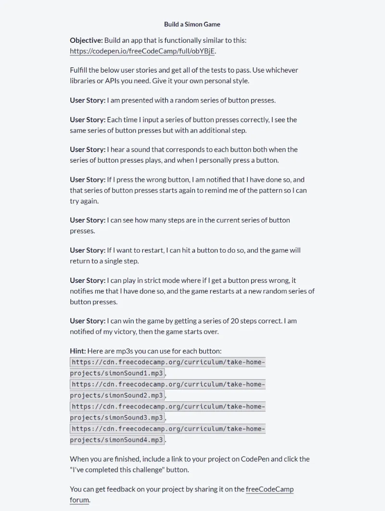
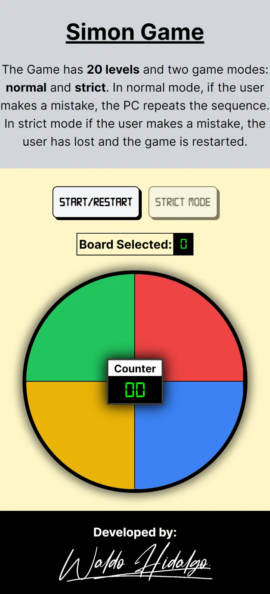
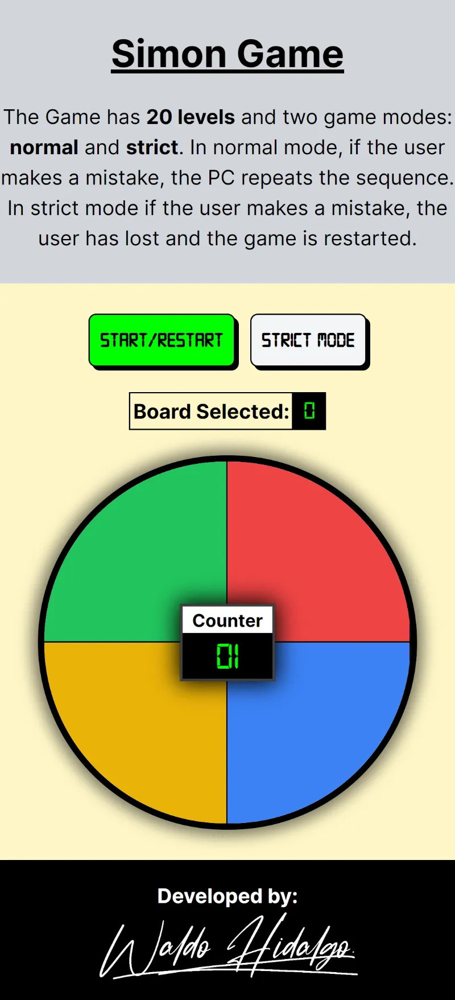
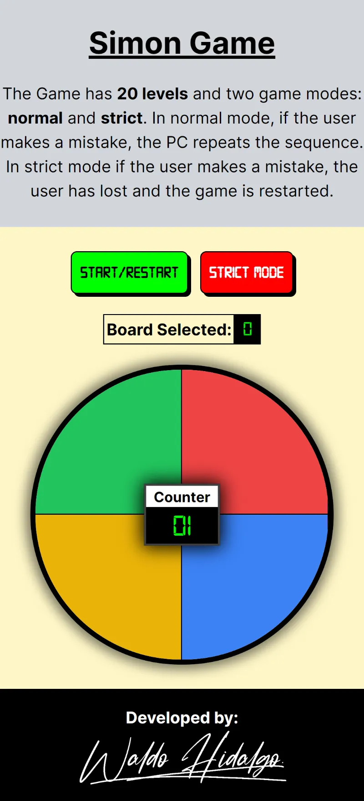
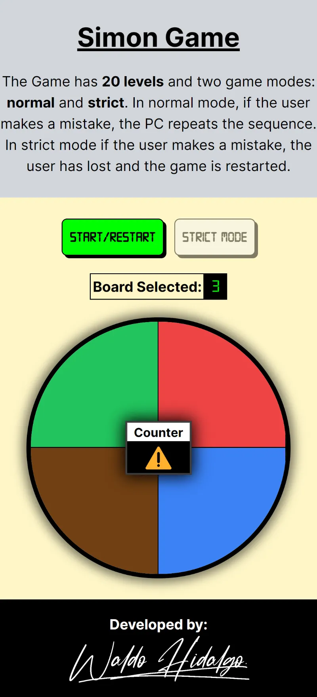
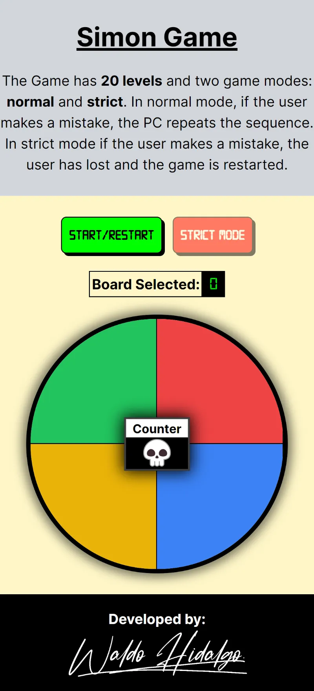
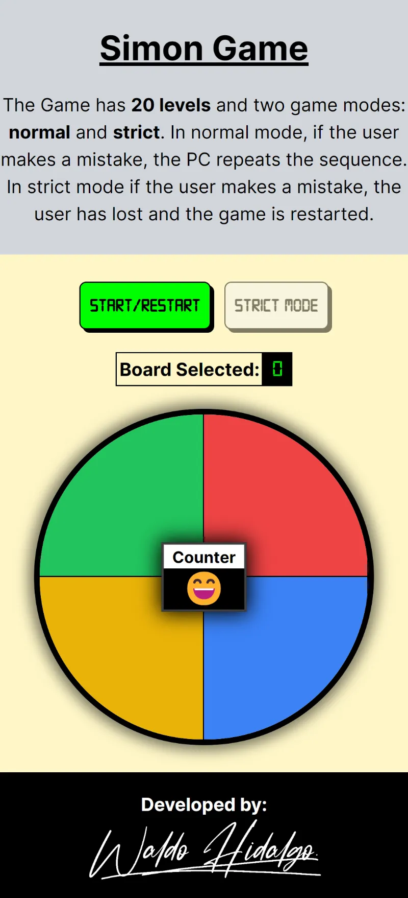

# Build a Simon Game

Proyecto [Build a Simon Game](https://www.freecodecamp.org/learn/coding-interview-prep/take-home-projects/build-a-simon-game) requisito obligatorio para obtener la **Legacy Front End Certification** de Freecodecamp. Este el décimo y último proyecto.

## Tabla de Contenidos

## Requisitos del Proyecto

## Proyecto Aprobado

## Screenshots

### 1-Estado Inicial

### 2-Modo normal

### 3-Modo estricto

### 4-Alerta Secuencia Erronea ingresada por Usuario

### 5-Alerta Game Over

### 6- Alerta Juego Ganado

